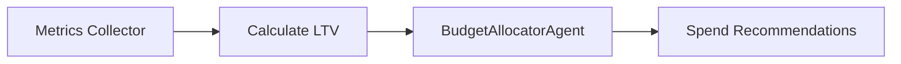

# Customer Lifetime Value Models

**Focus**: Estimating long‑term value to inform budget decisions

## Basic Calculation

```
LTV = Average Revenue per User * Gross Margin % * Retention Period
```

Where *Retention Period* measures how long users remain active.

## Cohort Approach

Segment users by acquisition channel and estimate LTV for each cohort.

```python
def calculate_ltv(revenue: float, conversions: int, months: int) -> float:
    arpu = revenue / conversions if conversions else 0
    return arpu * months
```

## Using LTV with BudgetAllocatorAgent

```
metrics = {
    "search": {"conversions": 50, "revenue": 2000, "ltv": 60},
    "social": {"conversions": 30, "revenue": 900, "ltv": 45},
}
```

Call `BudgetAllocatorAgent.run(metrics, target=3, goal="ROAS")` to weigh spend by expected lifetime value.



The agent logs prompts when `PROMPT_OBSERVABILITY=1` via `record_prompt`.
