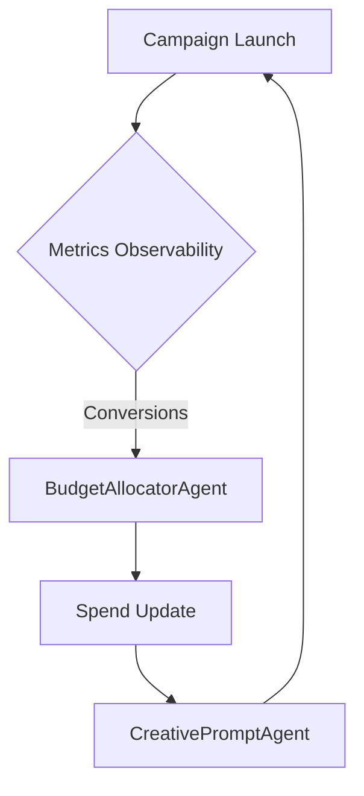

# PPC Growth Loops

**Source**: Reforge methodology adapted for paid advertising
**Focus**: Connecting campaign automation to iterative growth loops

## Loop Stages

1. **Traffic Generation** – Acquire clicks from search or social platforms.
2. **Conversion Feedback** – Collect conversions and revenue in near real time.
3. **Budget Reallocation** – Shift spend toward high‑return channels.
4. **Creative Refresh** – Generate new ad copy or assets based on results.

Each stage feeds the next, creating a reinforcing cycle when metrics improve.

## Agent Mapping

| Loop Stage | Responsible Agent | Prompt Example |
|------------|------------------|----------------|
| Traffic Generation | `GoogleAdsCampaignAgent`, `MetaAdsAgent` | "Launch promo with focus keywords X" |
| Conversion Feedback | `MetricsCollector` via `AsyncEventBus` | n/a |
| Budget Reallocation | `BudgetAllocatorAgent` | "Allocate $X with ROAS goal" |
| Creative Refresh | `CreativePromptAgent` | "Rewrite top ad using pain‑point Y" |

## Event‑Driven Automation



### Observability Example

```python
from o3research.marketing.prompt_observability import record_prompt

record_prompt("budget_cycle", "BudgetAllocatorAgent", "allocated spend")
```
